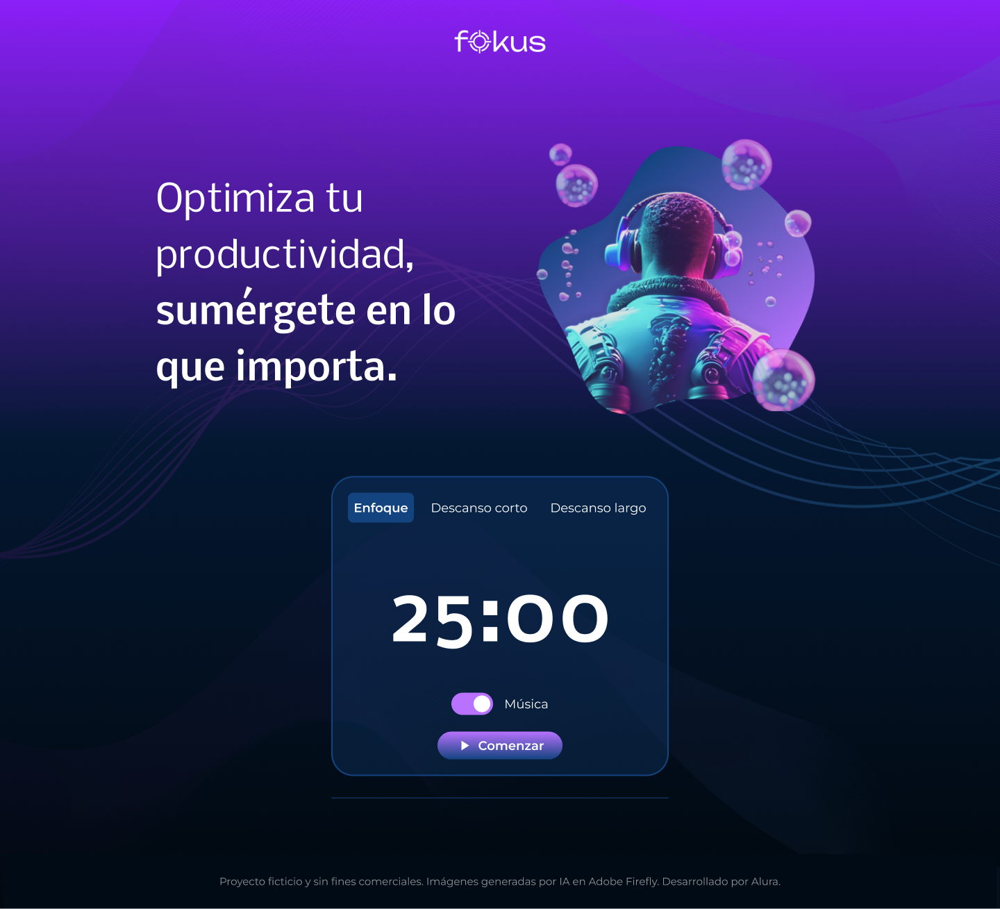
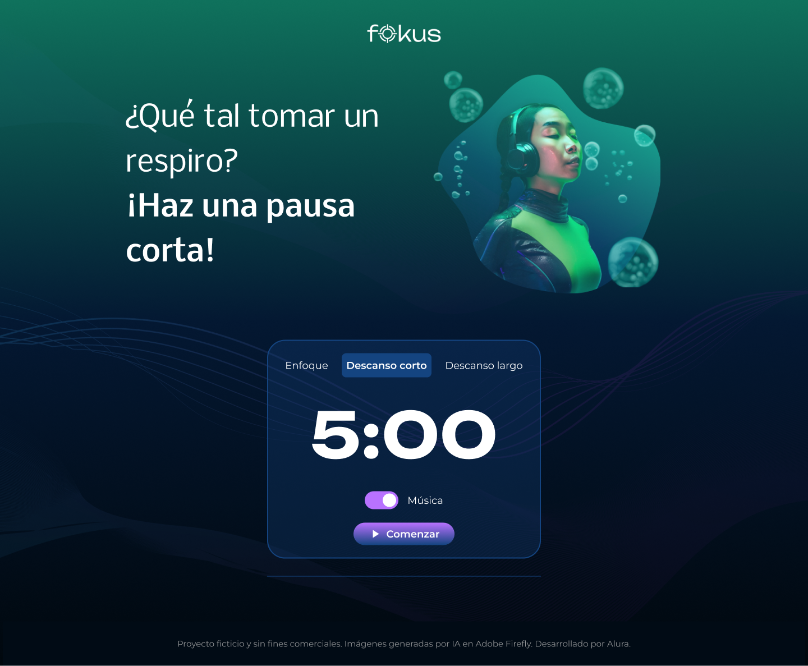
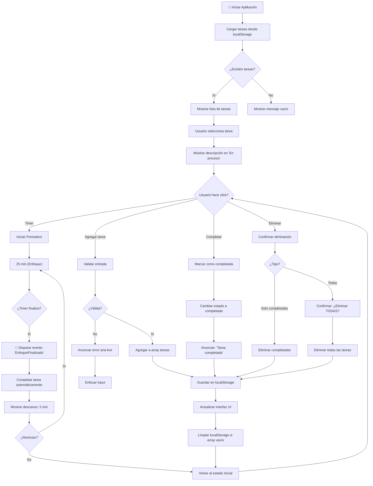
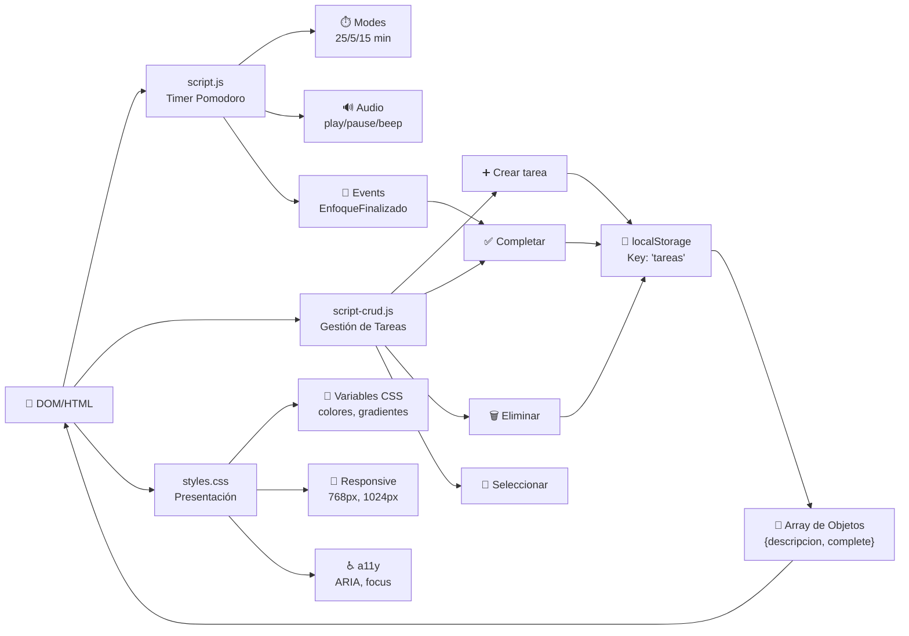

# 🎯 Fokus - Aplicación de Productividad Pomodoro

> Una aplicación web moderna de productividad que utiliza la técnica **Pomodoro** para ayudarte a mantener el enfoque y administrar tu tiempo de manera efectiva con gestión de tareas persistentes.

## ✨ Resumen

Proyecto desarrollado para reforzar competencias de frontend con JavaScript, manipulación del DOM y persistencia de datos en el navegador. La interfaz integra temporizador, audio de apoyo y una lista de tareas con estado activo.

## ℹ️ Información importante

- La aplicación se ejecuta directamente en el navegador, sin proceso de compilación.
- Las tareas se almacenan en `localStorage`, una API del navegador de tipo Web Storage, bajo la clave `tareas`.
- El temporizador y el CRUD de tareas se distribuyen en [script.js](script.js) y [script-crud.js](script-crud.js).
- Existe una región accesible `#a11y-status` para anunciar cambios de estado al lector de pantalla.
- La documentación de QA vive en [docs](docs) y complementa la validación funcional y de accesibilidad.

## 🎯 Objetivo general

Construir una aplicación web que permita gestionar tiempos de enfoque y una lista de tareas, manteniendo el estado entre sesiones mediante almacenamiento local.

## 🧩 Funcionalidades principales

- ⏱️ Temporizador con modos de enfoque y descanso.
- ▶️ Control de inicio y pausa del temporizador.
- 🎵 Audio de apoyo en la experiencia de uso.
- 📝 Formulario para agregar tareas.
- ✏️ Edición de la descripción por tarea.
- 📍 Selección de tarea activa que actualiza el área `#En proceso`.
- ✔️ Marcado de tareas completadas al finalizar el enfoque.
- 🗑️ Eliminación de tareas completadas (remover concluidas).
- 🗑️ Eliminación de todas las tareas (remover todas).
- 💾 Persistencia de tareas en la clave `tareas` de `localStorage`.
- ♿ Región de estado accesible `#a11y-status` para anuncios de cambios en la interfaz.

## 🛠️ Tecnologías Utilizadas


| Tecnología | Propósito |
|------------|----------|
| **HTML5** | Estructura semántica y accesible |
| **CSS3** | Estilos responsive con custom properties |
| **JavaScript ES6+** | Lógica interactiva y eventos |
| **Web Storage API** | Persistencia local de datos |
| **ARIA Attributes** | Accesibilidad mejorada |
| **Live Server** | Desarrollo local |

## 🎨 Vista General del Proyecto

### 📐 Arquitectura del Sistema

<div align="center">


> **Diagrama del sistema:** Representación visual del proyecto mostrando la arquitectura de la aplicación Fokus con JavaScript, manipulación de elementos del DOM y persistencia en localStorage.

</div>

### 📱 Interfaz de la Aplicación

#### Modo Enfoque - 25 minutos
<div align="center">



> **Optimiza tu productividad, sumérgate en lo que importa.** Pantalla principal con 25 minutos de concentración profunda. Interfaz limpia con toggle de música y botón para comenzar el temporizador.

</div>

#### Modo Descanso Corto - 5 minutos
<div align="center">



> **¿Qué tal tomar un respiro? ¡Haz una pausa corta!** Pantalla de descanso corto con 5 minutos para recuperarse. Transición visual con color verde refrescante.

</div>

#### Modo Descanso Largo - 15 minutos
<div align="center">


> **Hora de volver a la superficie. Haz una pausa larga.** Pantalla de descanso profundo con 15 minutos para recargar energías. Invita a reflexionar sobre lo logrado.

</div>

## 🏗️ Estructura del Proyecto

```
LocalStoragl/
├── index.html                    ← Punto de entrada
├── 404.html                      ← Página de error personalizada ✅
├── sitemap.xml                   ← Mapa del sitio (SEO) ✅
├── robots.txt                    ← Instrucciones para crawlers ✅
├── .htaccess                     ← Configuración Apache ✅
├── README.md                     ← Documentación principal
│
├── assets/                       ← Carpeta de recursos profesional
│   ├── css/
│   │   └── styles.css           (1,200+ líneas)
│   ├── js/
│   │   ├── script.js            (Lógica del temporizador)
│   │   └── script-crud.js       (Gestión de tareas)
│   ├── imagenes/
│   └── sonidos/
│
├── imagenes/                    ← Recursos (21 archivos)
│   ├── logo.png
│   ├── enfoque.png
│   ├── descanso-corto.png
│   ├── descanso-largo.png
│   ├── [+ 17 más]
│
├── sonidos/                     ← Recursos de audio
│   ├── luna-rise-part-one.mp3
│   ├── play.wav
│   ├── pause.mp3
│   └── beep.mp3
│
└── docs/                        ← Documentación completa
    ├── QA-README.md
    ├── QA-CHECKLIST.md         (40+ casos de prueba)
    ├── ACCESSIBILITY-STATEMENT.md
    └── REQUIREMENTS-TRACEABILITY.md
```

## 🧠 Lógica Algorítmica y Arquitectura

### Flujo Principal de la Aplicación



### Arquitectura de Componentes



**Nota:** Los diagramas muestran:
- **Flujo Principal:** Cómo fluye la lógica desde la carga hasta las acciones del usuario.
- **Arquitectura:** Cómo se comunican los módulos y dónde se persisten los datos.

## 🚀 Ejecución del proyecto

1. Abrir la carpeta [LocalStoragl](.) en VS Code.
2. Levantar un servidor local estático, preferiblemente con Live Server.
3. Abrir la URL local en el navegador.

## 📋 Guía de uso

1. Haz clic en `Agregar nueva tarea`.
2. Escribe la descripción.
3. Haz clic en `Guardar`.
4. Haz clic sobre una tarea para marcarla como activa.
5. Verifica el reflejo de la selección en el área `#En proceso`.
6. Usa el icono de edición para actualizar la descripción.

## 💾 Persistencia de datos

- Clave: `tareas`.
- Formato: arreglo de objetos JSON.

Ejemplo:

```json
[
  { "descripcion": "Preparar clase" },
  { "descripcion": "Revisar ejercicios" }
]
```

## ✅ Criterios de aceptación

- La aplicación carga sin errores bloqueantes en consola.
- Se puede agregar al menos una tarea y se mantiene tras recargar.
- Se puede editar una tarea existente.
- Al seleccionar una tarea, se aplica el estilo activo y se actualiza `#En proceso`.
- Los cambios de estado se anuncian en la región accesible `#a11y-status`.
- El temporizador responde al cambio de contexto y al inicio/pausa.

## 🧪 Checklist de validación

- [ ] Carga inicial correcta.
- [ ] Agregado de tareas funcional.
- [ ] Edición de tareas funcional.
- [ ] Persistencia en `localStorage` validada.
- [ ] Selección de tarea activa visible.
- [ ] Actualización del área `#En proceso` correcta.
- [ ] Flujo base del temporizador funcional.

## 🧾 Documentación de QA

- [QA README](docs/QA-README.md)
- [QA Checklist](docs/QA-CHECKLIST.md)
- [Requirements Traceability Matrix](docs/REQUIREMENTS-TRACEABILITY.md)
- [Accessibility Statement](docs/ACCESSIBILITY-STATEMENT.md)

## 🛟 Incidencias comunes

### No guarda tareas

- Revisar errores en [script-crud.js](script-crud.js).
- Confirmar la presencia de `.app__form-add-task` en [index.html](index.html).
- Limpiar `localStorage.tareas` si el JSON está corrupto.

### No aplica estilo activo

- Verificar la regla `.app__section-task-list-item-active.app__section-task-list-item` en [styles.css](styles.css).
- Confirmar que el clic se ejecute sobre el `li` creado dinámicamente.

### Mensaje "form detection precheck code injected"

- Suele provenir de extensiones del navegador, no del proyecto.
- Validar el comportamiento en modo incógnito o sin extensiones.

## � Cambios recientes

### Corrección del módulo de eliminación de tareas (script-crud.js)

Se corrigió y optimizó el bloque de controladores de eliminación de tareas:

**Problemas resueltos:**
- Error de sintaxis en la declaración de `const btnTareasCompletas.onclick`.
- Referencia de variable `selector` antes de su declaración.
- Tipo de dato incorrecto al asignar `tareas = ""` en lugar de `tareas = []`.
- Asignaciones duplicadas y conflictivas de eventos onclick.

**Solución implementada:**
- Creación de función reutilizable `eliminarTareas(soloCompletas)` que:
  - Define el selector condicional antes de usarlo.
  - Elimina elementos del DOM según el tipo de eliminación.
  - Actualiza el arreglo `tareas` manteniendo el tipo de dato (array).
  - Persiste cambios en `localStorage` mediante `actualizarTareas()`.
- Asignación clara de handlers:
  - `btnTareasCompletas.onclick = () => eliminarTareas(true);` → Elimina solo completas.
  - `btnEliminarTareas.onclick = () => eliminarTareas(false);` → Elimina todas.

## � CAMBIOS RECIENTES (v2.0) - Mejoras de Accesibilidad

### 6 Mejoras Principales Implementadas

#### 1. ✅ **Validación Robusta de Entrada**
- No permite tareas vacías o solo espacios
- Anuncio de error en aria-live
- Focus automático en textarea para corrección

#### 2. ✅ **Confirmación Preventiva**
```javascript
if (confirm("¿Estás seguro de que deseas eliminar TODAS las tareas?...")) {
    eliminarTareas(false);
}
```

#### 3. ✅ **Anuncios de Accesibilidad (aria-live)**
- Al agregar: `"Tarea agregada: [descripción]"`
- Al completar: `"Tarea completada: [descripción]"`
- Al eliminar: `"Se eliminaron X tarea(s) completada(s)"`

#### 4. ✅ **Variable Renombrada**
- `soloCompletas` → `eliminarSoloCompletadas` (claridad semántica)

#### 5. ✅ **Manejo Inteligente de Selección**
- Limpia automáticamente "En proceso" si la tarea activa es eliminada
- Resetea referencias internas correctamente

#### 6. ✅ **Contador Dinámico de Tareas Eliminadas**
- Feedback específico: "Se eliminaron 3 tarea(s) completada(s)"
- Información cuantificable para el usuario

**Estado:** ✅ Todas las funcionalidades validadas y documentadas

---

## 📊 Archivos de Configuración Agregados

| Archivo | Propósito | Estado |
|---------|----------|--------|
| **sitemap.xml** | Mapa del sitio para SEO | ✅ Creado |
| **robots.txt** | Instrucciones para crawlers | ✅ Creado |
| **.htaccess** | Configuración Apache (compresión, cache, seguridad) | ✅ Creado |
| **404.html** | Página de error personalizada | ✅ Creado |

---

## 🔮 Mejoras Futuras

- [ ] Integración con calendario
- [ ] Estadísticas de productividad
- [ ] Exportar/importar tareas
- [ ] Notificaciones de escritorio
- [ ] Sincronización en la nube
- [ ] Pruebas automatizadas (Jest/Vitest)
- [ ] Modo oscuro/claro
